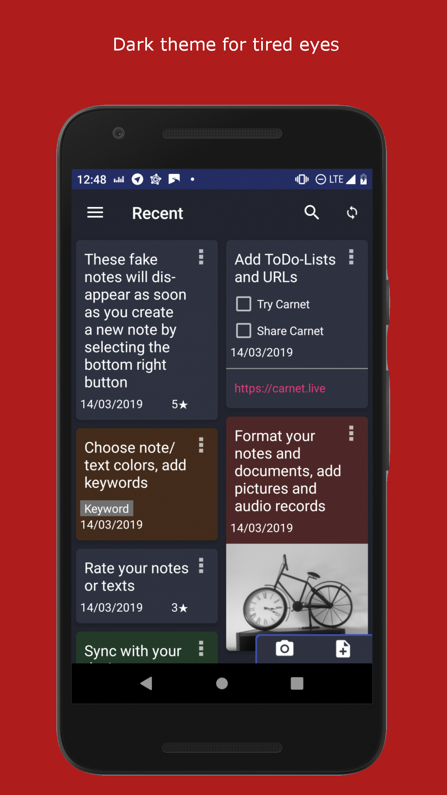

# Carnet

## Introduction

Carnet is a complete and rich note taking app for Android and Linux with sync capabilities
Be aware that this is still a beta version, I recommend not using Google Drive for now (ownCloud/NextCloud works perfectly)

Licence : GPLv3

Android [sources](../../../CarnetAndroid)

Desktop [sources](../../../CarnetElectron)

ownCloud/NextCloud [sources](../../../CarnetNextcloud)

getcarnet.app [sources](../../..//PhieF/CarnetLive)

## Download

[Android](https://qn.phie.ovh/binaries/android/current.apk)

[Linux 64 bits AppImage](https://qn.phie.ovh/binaries/desktop/current64.AppImage)

[Linux 32 bits AppImage](https://qn.phie.ovh/binaries/desktop/current32.AppImage)

[Daily Builds](https://qn.phie.ovh/binaries)

	 
 

## Online instances

[Carnet.live](https://carnet.live)

## Features

- Available as a ownCloud/Nextcloud App (online)
- Complete editor : bold/italic/underline/color/highlight
- Import from Google Keep (only on desktop, then sync on mobile)
- Insert images / review
- Open HTML format
- Organize with folders and choose root storage folder depending on your needs
- Keywords
- Quickly see your recent notes
- Search amount your notes
- Protect the app with a pin code (won't encrypt notes) on android
- Statistics : words/sentences/characters
- Sync with Google Drive, ownCloud and NextCloud
- Audio recording
- Dark theme
- ToDo lists
- Note background color

## To come

[See here](TODO.md)

## Sync Online version with Android

https://carnet.live is nothing more than a nextcloud server, so select Nextcloud and fill server / username / password

## Zoom in

### Android

   

### Desktop

   

## Follow us

Mastodon: https://framapiaf.org/@Carnet

RSS: https://framapiaf.org/@Carnet.atom

## Donations :

[All Donations](https://donation.carnet.live)

[LiberaPay](https://liberapay.com/Phie)

[Paypal](https://www.paypal.com/cgi-bin/webscr?cmd=_s-xclick&hosted_button_id=YMHT55NSCLER6)

## Help

You can help with translations on the dedicated platform

[Weblate](https://weblate.lostpod.me)

[Matrix room](https://matrix.to/#/#carnet:gauchiste.club)
