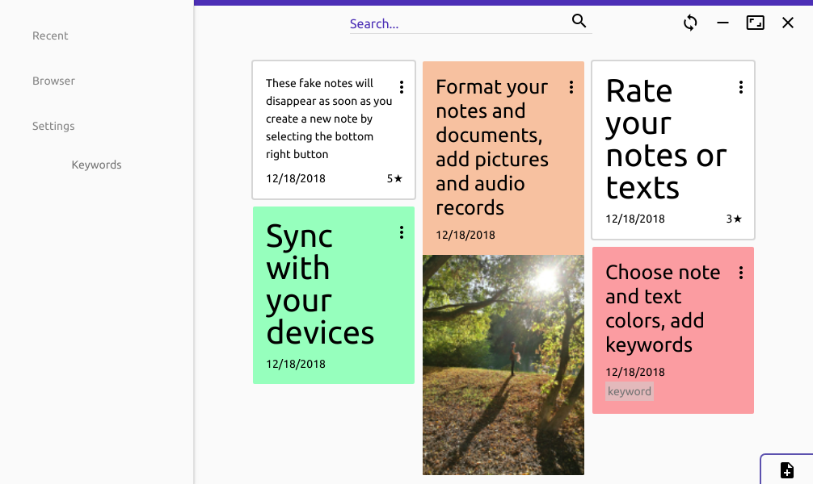

# Carnet

## Introduction

Carnet is a complete and rich note taking app for Android and Linux with sync capabilities
Be aware that this is still a beta version, I recommand not using Google Drive for now (NextCloud works perfectly)

## Download

[Android](https://qn.phie.ovh/binaries/android/current.apk)

[Linux 64 bits AppImage](https://qn.phie.ovh/binaries/desktop/current64.AppImage)

[Linux 32 bits AppImage](https://qn.phie.ovh/binaries/desktop/current32.AppImage)

[Daily Builds](https://qn.phie.ovh/binaries)

## Features

- Complete editor : bold/italic/underline/color/highlight
- Import from Google Keep (only on desktop, then sync on mobile)
- Insert images / review
- Open HTML format
- Organize with folders and choose root storage folder depending on your needs
- Keywords
- Quickly see your recent notes
- Search amount your notes
- Protect the app with a pin code (won't encrypt notes) on android
- Statistics : words/sentences/characters
- Sync with Google Drive and NextCloud

## To come

- NextCloud Online integration (as a nextcloud app)
- Perf improvements
- Lighter version for linux without Electron
- Windows / Mac OS electron app
- Many things I don't think about right now

## Sync Online version with Android

https://carnet.live is nothing more than a nextcloud server, so select Nextcloud and fill server / username / password

## Zoom in

### Notes overview

### Rich editor

### Media manager

Licence : GPLv3

Android [sources](../../../CarnetAndroid)

Desktop [sources](../../../CarnetElectron)

NextCloud [sources](../../../CarnetNextcloud)

Donations :

https://liberapay.com/Phie
